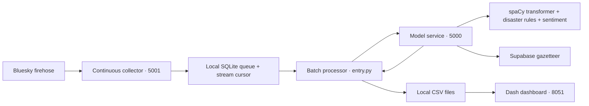

# Crisis Analysis

A college prototype that turns public social posts into a geographic view of potential crisis reports.

**[Open the live interview demo](https://crisis-analysis-interview-demo.onrender.com)** — a labeled, deterministic fixture walkthrough. It demonstrates the processing/dashboard flow without running live NLP, Supabase, or Bluesky ingestion.

## The problem

Social feeds can contain early reports of floods, wildfires, and other emergencies, but relevant posts are mixed with unrelated discussion. Manually finding disaster mentions, locating them, and grouping reports takes time.

## What the app does

Crisis Analysis collects posts from the Bluesky firehose, identifies disaster and location mentions, estimates text sentiment, and resolves locations using a Supabase gazetteer. It groups results by U.S. state and disaster type, then displays a map, report counts, and the underlying posts in a Dash dashboard.

The intended users are analysts and operations teams exploring social-media situational awareness. This project demonstrates an analysis workflow; it does not verify incidents or provide emergency alerts.

## Architecture



The processes run on one host (or in one development container). The model service and collector communicate with the processor over local HTTP. The dashboard reads CSV files on a two-second refresh interval. Ingestion uses a local retry queue while retaining those service boundaries and the existing NLP approach.

## Tech stack

| Layer | Implementation |
| --- | --- |
| Runtime | Python 3.12 |
| Ingestion | Bluesky AT Protocol client, Flask, SQLite retry queue |
| NLP | spaCy 3.8.4, `en_core_web_trf`, EntityRuler disaster patterns |
| Sentiment | spaCyTextBlob / TextBlob polarity |
| Location lookup | Supabase/PostgreSQL gazetteer |
| Processing/storage | pandas, local CSV files |
| Dashboard | Dash 2.18.2, Plotly |
| Serving/development | Waitress, Gunicorn, Docker, Jupyter |

The disaster pipeline is assembled from a pretrained English transformer and the rules in `proj-dev/data/disasters/disaster_types.json`. It is not a disaster classifier trained from scratch.

## Run the deterministic demo

This is the shortest rehearsal path. It injects a synthetic post, **“Flood in Austin Texas.”**, and replays a predefined model response over local HTTP. The real processor performs filtering, CSV writing, and aggregation; the real dashboard displays the results. **Fixture mode does not run NLP or query Supabase.** It is labeled in both the terminal and dashboard.

From the repository root, with Python 3.12 installed:

```sh
git clone --branch polish/interview-demo https://github.com/nikitab724/crisis-analysis.git
cd crisis-analysis
python3.12 -m venv .venv
source .venv/bin/activate
python -m pip install -r requirements-demo.txt
python proj-dev/app/live_demo/process_test_tweet.py --fixture --output-dir .demo
CRISIS_DATA_DIR="$PWD/.demo" python proj-dev/app/live_demo/dash_client.py
```

On Windows PowerShell, activate with `.venv\Scripts\Activate.ps1` and set `$env:CRISIS_DATA_DIR = "$PWD/.demo"` before running the dashboard command.

Open **http://localhost:8051**. Expect one Flood report in Texas, an Austin marker, and the synthetic post after selecting Texas in the dropdown. Repeating the injection replaces the two demo CSVs with the same result. Without `--output-dir`, the script validates temporary results and removes them on exit. Live CSVs are preserved. Stop the dashboard with Ctrl+C.

Map circles show **saved report records at each resolved location**, not a disaster radius. Circle area is proportional to the count through 64 records: diameters are 8 px for one record, 16 px for four, and 32 px for sixteen. Larger counts are capped at 64 px and labeled in the tooltip; exact counts remain visible. City points use their own gazetteer coordinates, while state-only or missing-city-coordinate records use a labeled approximate state centroid. Retries of the same source post/location are deduplicated; different posts may describe the same event. Counts are not verified incidents.

The browser's geographic basemap may require internet access to Plotly's geographic assets. Rehearse on the presentation network beforehand; the table and bar chart do not depend on the map download.

## Deploy to Render Free

For the **live app at the existing Render URL**, [use the Free gateway setup](docs/RENDER_FREE.md): set `LIVE_DASHBOARD_URL` to the Mac's current public tunnel origin and deploy the latest commit. Render serves the real dashboard and forwards its callbacks; NLP, Jev, ingestion, and CSVs remain on the Mac. The Mac and tunnel must stay online. This mode requires no model weights or provider secrets on Render, and never silently substitutes fixture results when the backend is unavailable.

With `LIVE_DASHBOARD_URL` unset, the same service starts the independent fixture described below.

[Deploy the fixture demo to Render](https://render.com/deploy?repo=https%3A%2F%2Fgithub.com%2Fnikitab724%2Fcrisis-analysis%2Ftree%2Fpolish%2Finterview-demo)

Sign in to Render, follow the link, and create the Blueprint from the `polish/interview-demo` branch. Review that the service uses the **Free** instance plan, then deploy it. The repository's `render.yaml` provides the settings:

| Setting | Value |
| --- | --- |
| Runtime | Python 3.12, via `.python-version` |
| Build command | `pip install -r requirements-hosted-demo.txt` |
| Start command | `bash scripts/start_demo.sh` |
| Health check | `/_dash-layout` |
| Instance plan | Free |

In fixture mode, the launcher regenerates the synthetic demo data at each start and runs one Gunicorn worker on the host's `PORT`. It requires no secrets, model weights, Supabase, or Bluesky access. The public dashboard explicitly labels its data as a fixture. It does not expose the model or ingestion APIs. Automatic deployments are disabled so a later push cannot interrupt interview rehearsal; redeploy manually when ready.

Render supplies the public `onrender.com` address after the service becomes live. Open that address and verify the fixture label, Texas map/chart, and post table. [Free instances sleep after 15 minutes without traffic](https://render.com/docs/free) and can take about a minute to wake. Open the page before your interview and keep the local demo available as a backup. No paid resources are defined by this Blueprint.

To rehearse the same server startup locally (stop any other app using port 8051 first):

```sh
python -m pip install -r requirements-hosted-demo.txt
bash scripts/start_demo.sh
```

For an alternate local port, run `PORT=8052 bash scripts/start_demo.sh`. The full live NLP/database deployment remains separate from this fixture deployment.

## Connect the real backend

The real backend uses a Supabase `gazetteer` table. The original backup has been recovered into a new Free Supabase project, and the real NLP → hosted database → dashboard path was verified with 193,736 location records on September 22, 2026. [Follow the backend setup guide](docs/BACKEND.md) for the separate Render Blueprint (`render-live.yaml`), secret environment settings, and local startup. The model, processor, and dashboard run together on one host because the dashboard reads their local CSVs.

The launcher first processes the known synthetic post using **real NLP and Supabase**, then serves the result. An optional `live` mode also collects Bluesky posts. For a public interview link with no additional hosting charge, [share the working local dashboard through a temporary Cloudflare tunnel](docs/BACKEND.md#share-the-real-local-demo-for-free). The Mac must remain awake and online.

For live collection, run `PORT=8052 MODEL_PORT=5002 SCRAPER_PORT=5004 python scripts/run_pipeline.py --mode live` in the prepared live environment after stopping an existing pipeline. The dashboard shows collection/analysis totals and update time even when a batch contains no crisis matches. Recent posts appear newest first, with state filtering and links to their Bluesky originals; the startup example is labeled separately. Counts represent resolved location records, not verified incidents or unique posts. A city and its supporting state count once. Only records with an explicit US country match and one of the 50 states or DC are saved or displayed; foreign and unresolved locations are skipped. Mixed-country posts can contribute their resolved US locations. Each result explains its matching basis.

The real model used about 2.6 GiB by itself locally, so hosting the model on Render requires a **paid instance with at least 4 GB RAM**; review pricing before creating it. The existing Free service instead forwards the Mac's live dashboard using the gateway setup above.

## Rebuild and verify the original NLP pipeline

Install the full environment and download the same base model used in the notebook:

```sh
python -m pip install -r requirements.txt
python -m spacy download en_core_web_trf
python build_disaster_model.py
python tests/check_disaster_model.py
```

`build_disaster_model.py` extracts the pipeline-building logic from `proj-dev/app/dataset_test.ipynb`:

1. Load `en_core_web_trf`.
2. Read the existing disaster labels and synonyms.
3. Generate the notebook's case-insensitive, lemma-derived optional-plural regex patterns.
4. Add an EntityRuler **before** the existing NER component, then add `spacytextblob`.
5. Save to `proj-dev/app/disaster_ner`.

The script resolves paths relative to the repository, so it can run from another working directory. Rebuilding replaces that generated model folder. The model weights remain ignored by Git. The transformer download is roughly 457 MB, with additional runtime dependencies and memory needed during loading/inference.

The integration check loads the saved pipeline through `live_demo/entity_extraction.py` and asserts that the example produces canonical disaster `Flood` and locations `Austin` and `Texas` (separate `GPE` entities, preserving the notebook's behavior). No Supabase account is required for this NLP-only check.

## Optional location selection and relevance screening with Jev

[Configure Jev through Vercel AI Gateway](docs/JEV.md) to screen candidate US reports for literal, current disaster mentions, including distinguishing an infectious-disease outbreak from a figurative “pandemic.” This optional step is off by default; it needs a server-side Gateway key, uses a provisional threshold, and does not verify that a claimed event is true. The original NLP and gazetteer remain in place.

The same integration can resolve an ambiguous city using context from the post: it chooses among real gazetteer entries or abstains. “Portland along the Willamette River” can select Oregon; “Portland” alone stays unresolved. It requires strong scores for both the choice and the presence of distinguishing context, then separately checks disaster relevance. Both stages share the configured request cap; coordinates always come from the database.

## Run with the real model service

Complete the model setup above, then create a local configuration file:

```sh
cp .env.example .env
```

Set `SUPABASE_URL` and `SUPABASE_KEY` for a database containing the existing `gazetteer` table. The live lookup expects these exact column names:

| Column | Expected content |
| --- | --- |
| `geonameid` | Unique GeoNames ID; stable tie-breaker for equal-population city matches |
| `name` | Place or state name |
| `featureCode` | GeoNames code, such as `PPL` or `ADM1` |
| `stateCode` | U.S. state abbreviation, such as `TX` |
| `countryCode` | Country code, such as `US` |
| `latitude`, `longitude` | Numeric coordinates |
| `alternate_list` | Searchable text of alternate names, comma-delimited for token matching |
| `population` | Numeric population for deterministic candidate ordering; not a confidence score |

The credentials must allow the server to read that table. For an expired project with a downloaded backup, [restore the gazetteer with the recovery guide](docs/GAZETTEER_RESTORE.md). The backup, populated database, and original GeoNames `US.txt` download are **not included** in Git. The legacy `proj-dev/data/load_csv.py` remains an experiment. Do not commit credentials.

In separate terminals with the environment activated, run:

```sh
# Terminal 1: model API, including Supabase location lookup
python proj-dev/app/live_demo/model_server.py

# Terminal 2: inject the known post through the real model API
python proj-dev/app/live_demo/process_test_tweet.py --output-dir .demo-live

# Terminal 3: show those results
CRISIS_DATA_DIR="$PWD/.demo-live" python proj-dev/app/live_demo/dash_client.py
```

The injector exits nonzero if it cannot produce both a crisis record and aggregate counts. This mode requires the model API and Supabase, but does not require Bluesky or the scraper. `GET http://127.0.0.1:5000/health` reports whether the NLP pipeline is loaded; `/ready` additionally verifies readable gazetteer rows and required columns. A missing model makes extraction return HTTP 503 instead of pretending a basic English model can detect custom disaster labels.

For continuous live collection, run these four processes in separate terminals:

```sh
python proj-dev/app/live_demo/model_server.py
python proj-dev/app/live_demo/firehose_scraper_server.py
python proj-dev/app/live_demo/entry.py
python proj-dev/app/live_demo/dash_client.py
```

The collector keeps one Bluesky connection open while the processor drains batches of up to 20 posts from a local SQLite queue. Each stream position is committed with its posts; reconnects request replay from that saved position. Batches remain queued until analysis and CSV writes succeed. A retry of the same source post/location cannot add another count. The dashboard refreshes every two seconds and shows a short notice only for an interruption, a queue delayed by at least 30 seconds, or known coverage gaps. Routine diagnostics remain available through `/activity`. See [continuous ingestion and its limits](docs/BACKEND.md#continuous-ingestion).

A conservative precheck uses the loaded notebook's exact token rules to skip transformer inference on non-candidates; candidate posts still run the original NLP, geocoding, and Jev checks. Default standalone live outputs are `filtered_posts.csv` and `crisis_counts.csv` beside the live-demo scripts; the supervisor uses a temporary run directory. If changing `CRISIS_DATA_DIR`, use the same absolute path for the processor and dashboard. Do not run multiple CSV-writing processors against the same directory.

## Docker

The Docker image installs dependencies and the base English transformer. It contains the repository, but the custom disaster pipeline still needs to be built. Its default command is `sleep infinity`; it does not automatically launch services.

From the repository root (POSIX shell):

```sh
docker build -t crisis-analysis .
docker run -d --name crisis-analysis-demo \
  -p 127.0.0.1:8051:8051 \
  -v "$PWD:/workspace" crisis-analysis

# Repeatable fixture demo; no credentials required
docker exec crisis-analysis-demo python proj-dev/app/live_demo/process_test_tweet.py --fixture --output-dir .demo
docker exec -d -e CRISIS_DATA_DIR=/workspace/.demo crisis-analysis-demo \
  gunicorn --chdir /workspace/proj-dev/app/live_demo dash_client:server \
  --bind 0.0.0.0:8051 --workers 1 --threads 2
```

For the real model path, keep `.env` at the mounted repository root, build the custom pipeline, and run the model server:

```sh
docker exec crisis-analysis-demo python build_disaster_model.py
docker exec -d crisis-analysis-demo python proj-dev/app/live_demo/model_server.py
docker exec crisis-analysis-demo python proj-dev/app/live_demo/process_test_tweet.py --output-dir .demo-live
```

Start a dashboard pointing at `/workspace/.demo-live` using the same Gunicorn command with that `CRISIS_DATA_DIR`. Stop an already-running dashboard/container before switching modes; both modes use port 8051. For continuous collection, also start `firehose_scraper_server.py` and `entry.py` with `docker exec -d`.

| Port | Purpose | Published to host? |
| --- | --- | --- |
| `8051` | Dash/Gunicorn dashboard | Yes, bound to host loopback |
| `5000` | Local model API | No |
| `5001` | Local firehose API | No |
| `8888` | Optional Jupyter notebook | Only if explicitly requested at container creation |

If macOS already occupies port 5000, use the container path. For notebook work, add `-p 127.0.0.1:8888:8888` when creating the container and run `jupyter notebook --ip=0.0.0.0 --port=8888 --no-browser --allow-root` inside it. Keep Jupyter's token authentication enabled.

Stop the demo with `docker stop crisis-analysis-demo`; remove its stopped container with `docker rm crisis-analysis-demo` before recreating it. Mounted source files, generated model weights, and demo outputs remain on the host.

## Checks

```sh
# Runs with requirements-demo.txt; no model or credentials needed
python -m unittest discover -s tests -v

# Requires the rebuilt real model
python tests/check_disaster_model.py

# Real model/API/CSV integration, with controlled database responses
python tests/check_model_pipeline.py

# Full startup, real Supabase SDK over controlled HTTP, dashboard, and failure cleanup
python tests/check_backend_runtime.py
```

The regression suite covers HTTP fixture injection, deterministic CSV output, dashboard callbacks, scraper restoration after failure, stale-output rejection, safe CSV list parsing, and empty/error handling. See [docs/VALIDATION.md](docs/VALIDATION.md) for the checks actually run during cleanup and remaining blockers.

## Limitations and next steps

- **Unverified social reports:** keyword/rule matches can include figurative language, historical reports, negation, and misinformation. Human review is required.
- **U.S.-focused location handling:** exact names/aliases must resolve uniquely within the available context. Ambiguous names and unsupported foreign places remain unresolved and are excluded from the dashboard and saved reports. “Georgia” needs a resolved US city, a state abbreviation, or explicit US context. A unique US database match is still not proof of the intended real-world location; counties, indirect references, and missing context remain limitations. Match labels describe rules, not calibrated confidence.
- **Counts represent resolved locations:** a city and its supporting state count once per post; different cities or states can still create several rows. Only the first disaster label is aggregated, and deduplication is within a batch, not across all runs.
- **Heuristic statistics:** “severity” is a relative report-count z-score, not physical impact. Accumulated sentiment currently averages batch means without weighting by batch size.
- **Taxonomy is inherited:** for example, tornado synonyms map to `Hurricane`. The cleanup preserves the notebook's rules rather than changing classification behavior.
- **Prototype storage and services:** individual CSVs are replaced atomically, but the posts/counts pair is not a transaction. There is no user authentication or durable hosted report history. A local acknowledged queue and saved cursor provide retry/reconnect recovery; the launcher is not a production orchestration system. Coverage begins when the collector first starts and is limited by provider replay availability, oversized commits, disk capacity, and network outages. It does not provide complete historical backfill.
- **Reproducibility limits:** primary versions are pinned, but not all transitive dependencies. A full cross-platform lockfile and CI are future work.
- **Legacy experiments:** `proj-dev/app/main.py`, `live_demo/scraper_server.py`, `gazetteer_db.py`, and the notebook are not the supported demo startup path. The old scraper references an absent `blueskyapi_copy` module.

For a technical-sales walkthrough, explain the user need, follow one post through the service boundaries, show its location and supporting text, and close with the limits above and the validation needed before operational use. Do not claim production readiness or measured model accuracy from the fixture demo.
